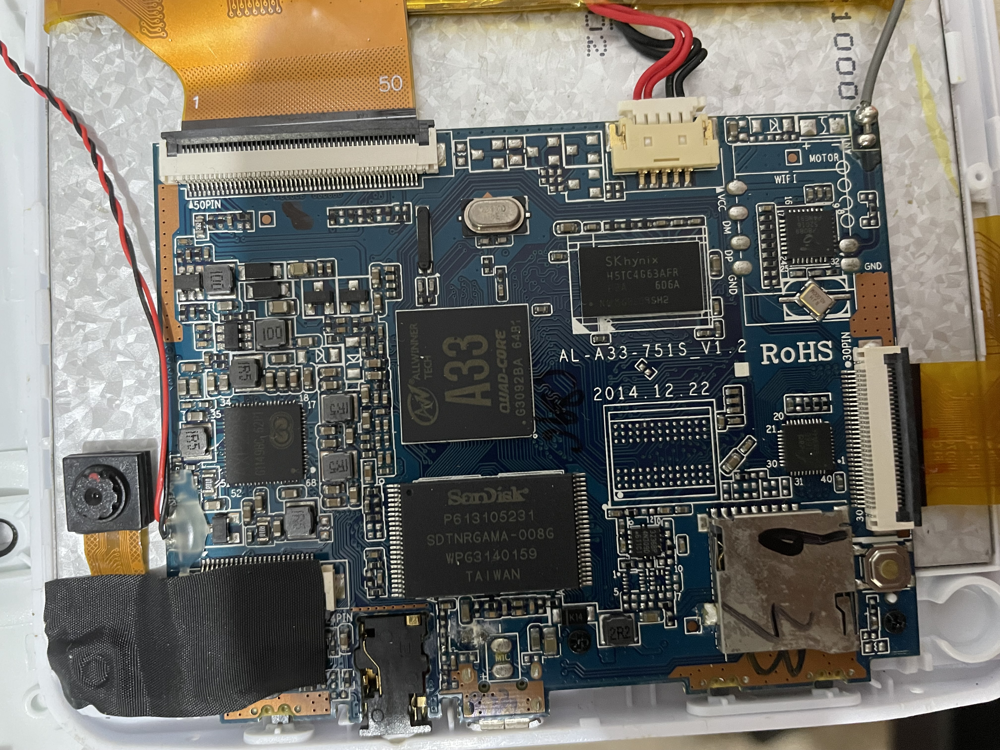

# Multilaser-M7S-tablet

This is a common tablet sold in Brazil, since the support for the devices stopped a few years back (2018) I figure that I could do some hacking on it.
This repository is a way that I can share my findings with others interested in hacking their own devices.

## Exploring the hardware and software

The goal here is to document the findings of this hardware and how can we flash a new software on it.

### About

Going into settings -> About tablet we got:

| Property          | Value                     |
| ------------------|---------------------------|
| Model Number      | ML01-M7S-Quad-Core        |
| CPU               | QuadCore - A33            |
| Android Version   | 4.4.2                     |
| Firmware Version  | SDK2.1                    |
| Kernel Version    | 3.4.39                    |
| Version Number    | M7SQC.SDK2.1_V4_20160315k |

### Hardware

|                       Front                       |                      Back                     |
|:-------------------------------------------------:|:---------------------------------------------:|
|        |     |

As can be seen in the picture the name in the PCB is AL-A33-751S_V1.2

Some components that I could identify from the PCB:

|           Component           |                           Model                           |
|-------------------------------|-----------------------------------------------------------|
| CPU                           | [A33](./docs/Datasheets/A33/Allwinner-Tech-A33.pdf)       |
| SDRAM                         | [H5TC4G63AFR-606A](./docs/Datasheets/SDRAM/H5TC4G43AFR.PDF) |
| Flash Memory                  | SDTNRGAMA-008G                                            |
| PMIC                          | [AXP223](./docs/Datasheets/PMIC/AXP223.PDF)               |
