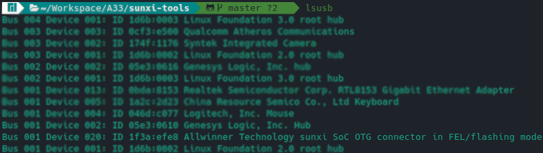

# A33

The A33 user manual says that: "can boot sequentially from NAND
Flash, eMMC NAND, SPI Nor Flash, SD card (SDC 0/2) and USB, but if you want to boot the system directly from
USB, the UBOOT_SEL pin pulled up by internal 50K resistor in the normal state can be set to a low level." since this
is a tablet I know that the resistor pin is not set. Here's the diagram from the manual about the boot sequence


The Boot Rom (BROM) of the A33 chip runs a subroutine called FEL, that is used to program and recover devices. The first attempt to boot is the first SD Card (SDC0). The sunxi-tools repository provides a SD Card boot image that makes the device jump to FEL mode.

``` bash
wget https://github.com/linux-sunxi/sunxi-tools/raw/master/bin/fel-sdboot.sunxi
dd if=fel-sdboot.sunxi of=/dev/sdX bs=1024 seek=8
```

Inserting the SD card the device shows nothing on the screen and we can then use the sunxi-fel tool to work with the device in this state.

## sunxi-tools

The Allwinner family comes with a set of utilities for development. One of these tools is called fel, which establishes communication, reading, and writing from the device in this mode.

### Compiling

The repository can be found [here](https://github.com/linux-sunxi/sunxi-tools), the packages need to build the tools are informed in the Readme of the project. Since I'm working in Arch, these are what I need to build the tools:

``` bash
git libusb zlib
```

And to build the tools is simple as running:

``` bash
git clone https://github.com/linux-sunxi/sunxi-tools.git
cd sunxi-tools
make
```

### Testing

After inserting the SD card with the FEL mode, connecting the tablet with my notebook and power in up the device my system could see the Allwinner device:



And using the sunxi-fel tool the device shows


Testing, a realized that this command fails sometimes. Returning "ERROR: Allwinner USB FEL device not found!"

## References

https://linux-sunxi.org/FEL