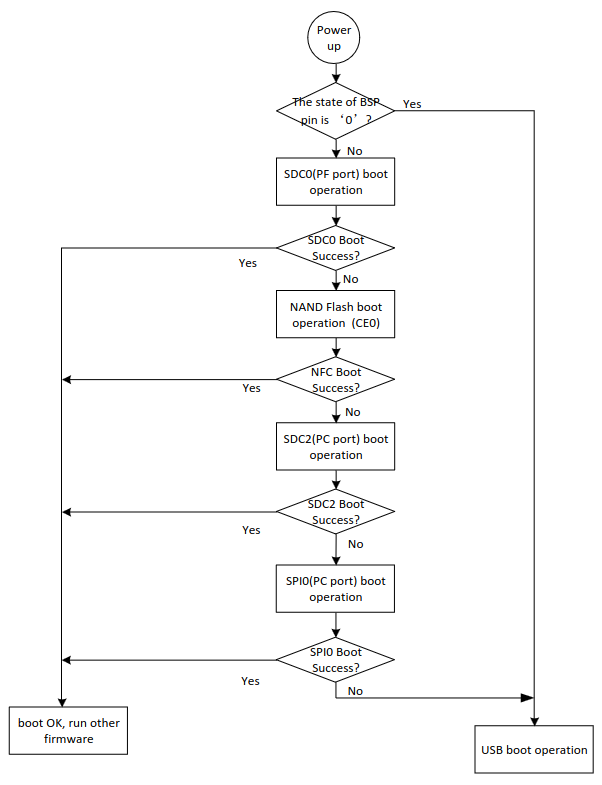
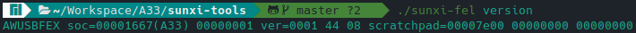

# A33

The A33 user manual says that: "can boot sequentially from NAND
Flash, eMMC NAND, SPI Nor Flash, SD card (SDC 0/2) and USB, but if you want to boot the system directly from
USB, the UBOOT_SEL pin pulled up by internal 50K resistor in the normal state can be set to a low level." since this
is a tablet I know that the resistor pin is not set. Here's the diagram from the manual about the boot sequence



The Boot Rom (BROM) of the A33 chip runs a subroutine called FEL, that is used to program and recover devices. The first attempt to boot is the first SD Card (SDC0). The sunxi-tools repository provides a SD Card boot image that makes the device jump to FEL mode.

``` bash
wget https://github.com/linux-sunxi/sunxi-tools/raw/master/bin/fel-sdboot.sunxi
dd if=fel-sdboot.sunxi of=/dev/sdX bs=1024 seek=8
```

Inserting the SD card the device shows nothing on the screen and we can then use the sunxi-fel tool to work with the device in this state.

## sunxi-tools

The Allwinner family comes with a set of utilities for development. One of these tools is called fel, which establishes communication, reading, and writing from the device in this mode.

### Compiling

The repository can be found [here](https://github.com/linux-sunxi/sunxi-tools), the packages need to build the tools are informed in the Readme of the project. Since I'm working in Arch, these are what I need to build the tools:

``` bash
git libusb zlib
```

And to build the tools is simple as running:

``` bash
git clone https://github.com/linux-sunxi/sunxi-tools.git
cd sunxi-tools
make
```

### Testing

After inserting the SD card with the FEL mode, connecting the tablet with my notebook and power in up the device my system could see the Allwinner device:


And using the sunxi-fel tool the device shows



Testing, a realized that this command fails sometimes. Returning "ERROR: Allwinner USB FEL device not found!"

## U-Boot

U-boot is a bootloader, its function is to prepare the system for the kernel to take over. The U-boot is an open-source bootloader and has been the main choice in the industry over the last few years.

### Compiling U-Boot

The source code can be obtained from github

``` bash
git clone https://github.com/u-boot/u-boot.git
cd u-boot
```
To compile the bootloader for the tablet we have to use a toolchain, the toolchain function is to generate binary code for the tablet's processor architecture (ARM). The tablet's architecture is 32 bits ARM, so we have to use the arm-linux-gnueabihf-.

Brief explanation of the toolchains name:
- arm: the architecture that the binary will be compiled for.
- linux: means that the headers for the linux system will be included.
- gnu: Compiler
- eabi: extended application binary interface. How data is organized in this specific machine.
- hf: The eabi generated will use hardware floating points.

To get this cross-toolchain (cross because is compiled for an architecture different from the machine which will compile the code) we can download it from arm's [website](https://developer.arm.com/downloads/-/arm-gnu-toolchain-downloads) or the repositories.

To build the U-boot I'will use a docker container with the following packages installed:

``` bash
bc \
bison \
build-essential \
device-tree-compiler \
flex \
gcc-arm-linux-gnueabihf \
git \
libfdt-dev \
libncurses-dev \
libssl-dev \
make \
swig \
pkg-config \
python3-dev \
python3-setuptools \
sudo \
usbutils \
u-boot-tools
```

``` bash
git clone https://github.com/u-boot/u-boot.git
cd u-boot
```

Grepping for configs that have an A33 as the SoC:

``` bash
find . -type f -name "*_defconfig" -exec grep -H --color "A33" \{\} +
./u-boot/configs/A33-OLinuXino_defconfig:CONFIG_MACH_SUN8I_A33=y
./u-boot/configs/Bananapi_m2m_defconfig:CONFIG_MACH_SUN8I_A33=y
./u-boot/configs/Nintendo_NES_Classic_Edition_defconfig:CONFIG_MACH_SUN8I_A33=y
./u-boot/configs/Sinlinx_SinA33_defconfig:CONFIG_MACH_SUN8I_A33=y
./u-boot/configs/ga10h_v1_1_defconfig:CONFIG_MACH_SUN8I_A33=y
./u-boot/configs/iNet_D978_rev2_defconfig:CONFIG_MACH_SUN8I_A33=y
./u-boot/configs/parrot_r16_defconfig:CONFIG_MACH_SUN8I_A33=y
./u-boot/configs/q8_a33_tablet_1024x600_defconfig:CONFIG_MACH_SUN8I_A33=y
./u-boot/configs/q8_a33_tablet_800x480_defconfig:CONFIG_MACH_SUN8I_A33=y
```

Searching for each board online, I found:
- A33-OLinuXino, Bananapi_m2m, and Sinlinx_SinA33, are dev boards
- Nintendo_NES_Classic_Edition is a console
- ga10h_v1_1, iNet_D978_rev2, and q8 are tablets
- parrot is a board for drones

Looking at the tablet's configurations, the only one that has the right resolution for my tablet is the q8_a33_tablet_800x480.

So to build u-boot just load de configuration from the defconfig and compile.

``` bash
export CROSS_COMPILE=arm-linux-gnueabihf-
make q8_a33_tablet_800x480_defconfig
make -j$(nproc)
```

This will produce the artifacts needed to boot.

### USB

The A33 chip supports booting over USB in fel mode. The binary used to boot over FEL is the u-boot-sunxi-with-spl.bin

``` bash
./sunxi-fel uboot u-boot-sunxi-with-spl.bin
```

## References

https://linux-sunxi.org/FEL
https://linux-sunxi.org/FEL/USBBoot